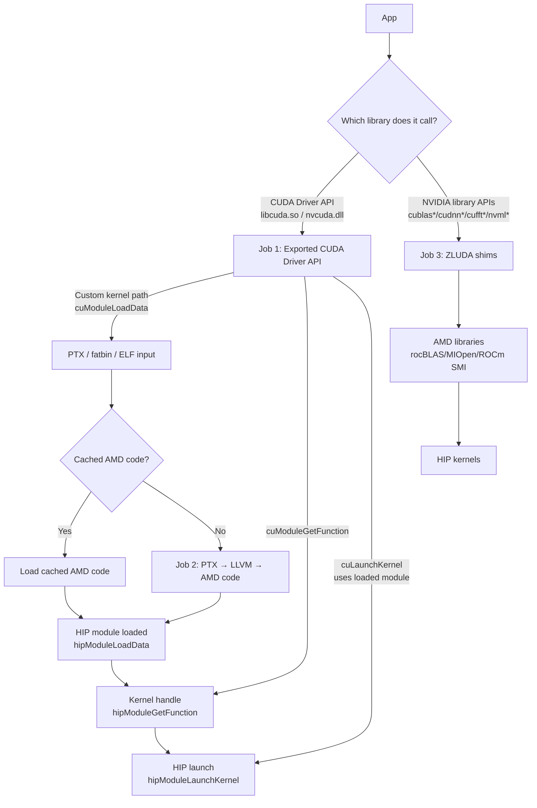

```mermaid
flowchart TD
    A[App] --> B{Which library does it call?}

    B -->|CUDA Driver API
libcuda.so / nvcuda.dll| C[Job 1: Exported CUDA Driver API]

    C -->|Custom kernel path
cuModuleLoadData| D[PTX / fatbin / ELF input]
    D --> E{Cached AMD code?}
    E -->|Yes| F[Load cached AMD code]
    E -->|No| G[Job 2: PTX → LLVM → AMD code]
    F --> H[HIP module loaded
hipModuleLoadData]
    G --> H
    C -->|cuModuleGetFunction| J[Kernel handle
hipModuleGetFunction]
    H --> J
    C -->|cuLaunchKernel
uses loaded module| I[HIP launch
hipModuleLaunchKernel]
    J --> I

    B -->|NVIDIA library APIs
cublas*/cudnn*/cufft*/nvml*| K[Job 3: ZLUDA shims]
    K --> L[AMD libraries
rocBLAS/MIOpen/ROCm SMI]
    L --> M[HIP kernels]
```
